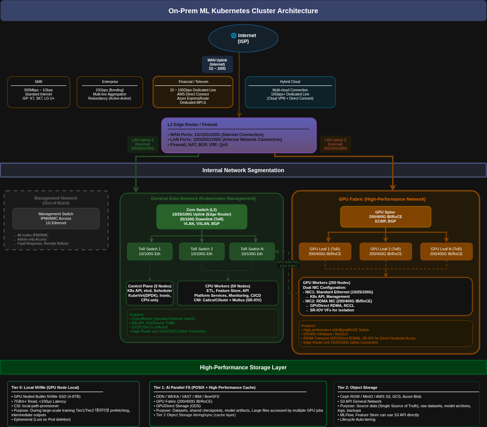

# GPU Scheduler for Kubernetes

The GPU Scheduler is a Kubernetes extension designed to provide smart, atomic, and topology-aware GPU allocation for workloads. It addresses limitations in the default Kubernetes scheduler by offering fine-grained control over GPU resources, ensuring efficient utilization and preventing race conditions.


## Features

- **Atomic Allocation**: Uses Kubernetes Coordination Leases to lock GPUs, preventing double-booking and race conditions.
- **Topology Awareness**: Optimizes GPU assignment based on NVLink topology to maximize bandwidth for multi-GPU workloads.
- **Fine-Grained Control**: Supports requesting specific GPU counts, contiguous allocation policies, and specific GPU IDs.
- **Three-Component Architecture**:
    - **Scheduler Plugin**: Integrates with the Kubernetes scheduling framework.
    - **Webhook**: Injects `CUDA_VISIBLE_DEVICES` environment variables into pods.
    - **Agent**: Runs on nodes to discover and report GPU health and topology.

## Architecture

The system consists of three main components:

1.  **Scheduler Plugin**: Filters and scores nodes based on GPU availability and topology. It reserves GPUs by creating Lease objects.
2.  **Webhook (Mutator)**: Intercepts pod creation requests and injects the assigned GPU IDs into the container's environment variables.
3.  **Agent (DaemonSet)**: Runs on each GPU node to discover hardware details (topology, health) and update `GpuNodeStatus` resources.

For a deep dive into the architecture, see [Architecture Guide](architecture.md).

## On-Premises ML Cluster Architecture

The GPU Scheduler is designed to operate within high-performance on-premises ML clusters, where network topology and resource isolation are critical.



In this architecture:

-   **Control Plane (General Data Network)**: The Kubernetes control plane and standard workloads run on a general-purpose network (10/25/100G Ethernet). The **GPU Scheduler** runs here, orchestrating resources across the cluster.
-   **GPU Workers (GPU Fabric)**: GPU nodes are connected via a dedicated high-performance fabric (200/400G IB/RoCE) for model training traffic (NCCL).
-   **Topology Awareness**: The scheduler optimizes allocations to ensure multi-GPU jobs run on nodes within the same NVLink domain or high-bandwidth switch group, minimizing latency on the GPU Fabric.
-   **Agent Role**: The **Agent** runs on the GPU workers, discovering the local topology and reporting health status back to the scheduler on the Control Plane.

## Prerequisites

- Kubernetes cluster 1.33.x (verified)
- Nodes with NVIDIA GPUs
- NVIDIA device plugin installed
- Helm 3 installed

## Installation


### 1. Setup Webhook Certificates

The admission webhook requires TLS certificates. You can generate them using the provided script:

```bash
curl -sL https://raw.githubusercontent.com/restack/gpu-scheduler/main/hack/gen-webhook-certs.sh | bash -s -- default
```

For more details, see [Webhook Certificates Guide](webhook-certificates.md).

### 2. Install with Helm

```bash
helm install gpu-scheduler ../charts/gpu-scheduler
```

## Usage

### Single GPU Request

```yaml
apiVersion: gpu.scheduling/v1
kind: GpuClaim
metadata:
  name: single-gpu
spec:
  devices:
    count: 1
    exclusivity: Exclusive
---
apiVersion: v1
kind: Pod
metadata:
  name: gpu-test
  annotations:
    gpu.scheduling/claim: single-gpu
spec:
  schedulerName: gpu-scheduler
  containers:
    - name: cuda-test
      image: nvidia/cuda:12.4.1-runtime-ubuntu22.04
      resources:
        limits:
          nvidia.com/gpu: "1"
```

### Multi-GPU (Contiguous)

```yaml
apiVersion: gpu.scheduling/v1
kind: GpuClaim
metadata:
  name: multi-gpu
spec:
  devices:
    count: 4
    policy: contiguous
    exclusivity: Exclusive
  topology:
    mode: Preferred
```

For more examples and advanced usage, see [Usage Guide](usage.md).

## Development

### Prerequisites

- Go 1.24.x
- Docker
- Kind (Kubernetes in Docker)

### Build

```bash
# Build all images
make docker-all
```

### Local Development with Kind

```bash
# Create cluster
kind create cluster --config ../hack/kind-cluster.yaml

# Build and load images
make docker-all
kind load docker-image ghcr.io/restack/gpu-scheduler:dev --name kind
kind load docker-image ghcr.io/restack/gpu-scheduler-webhook:dev --name kind
kind load docker-image ghcr.io/restack/gpu-scheduler-agent:dev --name kind

# Deploy

helm install gpu-scheduler ../charts/gpu-scheduler
```

For detailed development instructions, see [Development Guide](development.md).

## Documentation

- [Architecture](architecture.md)
- [Usage Guide](usage.md)
- [Development Guide](development.md)
- [Docker Guide](docker.md)
- [API Reference](api-reference.md)
- [RBAC](rbac.md)
- [Webhook Certificates](webhook-certificates.md)
